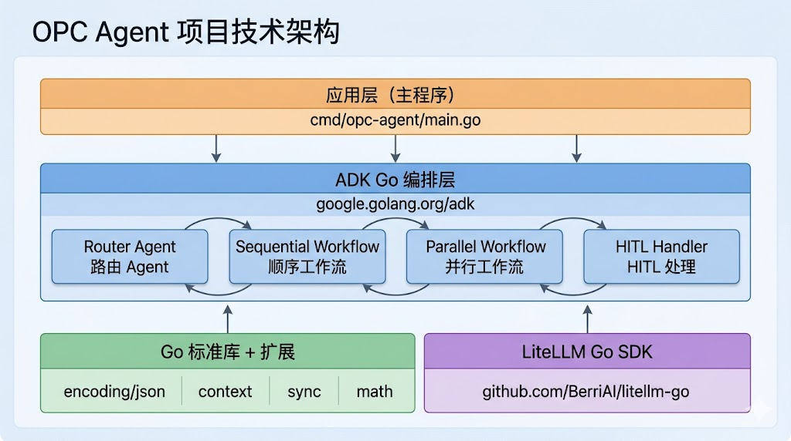

# OPC-Agent 项目技术路线文档

> **版本**：v1.0  
> **日期**：2026-05-09  
> **关联文档**：[项目需求说明书 v1.1](./01%20多任务智能协助系统（OPC-Agent）——项目需求说明书.md)  
> **项目代号**：OPC-Agent

---

## 1. 技术选型全景

| 层次 | 技术选型 | 版本 | 选型理由 |
|------|----------|------|----------|
| **编程语言** | Go | 1.23+ | 静态编译单二进制、零运维依赖；goroutine 原生并发；强类型编译期捕获错误；适合单人开发者维护 |
| **主程序框架** | 自研（Go Plugin 运行时） | — | 通过 `plugin.Open()` 动态加载 Agent 插件，新增 Agent 无需重编主程序 |
| **Agent 插件框架** | Google ADK Go | 1.0 | 各 Agent 插件内部使用 ADK 定义自身的 Agent 逻辑；ADK 不暴露到主程序 |
| **模型服务** | LiteLLM + Gemini Flash | — | 100+ 模型统一 API 接口；可按预算灵活切换后端；MVP 优先使用 Gemini Flash 免费额度 |
| **插件机制** | Go `plugin` 标准库 | 1.23+ | 原生 `go build -buildmode=plugin` 编译 .so 共享库，运行时 `plugin.Open()` 加载 |
| **向量记忆** | 嵌入式 Go 引擎 | — | 纯 Go 实现 cosine similarity 搜索 + JSON 文件持久化；零外部依赖；接口抽象后未来可迁至 pgvector |
| **可观测性** | OpenTelemetry + 控制台日志 | — | ADK Go 1.0 原生集成（在插件内使用）；主程序通过结构化日志记录 |
| **序列化** | encoding/json + protobuf | — | Agent 间产物契约用 protobuf 定义；记忆持久化用 JSON（人类可读，方便调试） |
| **构建工具** | Go toolchain (go build) | 1.23+ | 主程序普通编译；插件使用 `-buildmode=plugin` 编译 .so |
| **测试框架** | Go testing + testify | — | 标准 testing 包 + assert 断言库；无需第三方测试框架 |

---

## 2. 技术依赖关系



### 依赖包清单（MVP）

| Go 包 | 用途 | 所在模块 | MVP 必须 |
|-------|------|----------|----------|
| `google.golang.org/adk` | Agent 编排框架 | Agent 插件 .so 内使用 | 是 |
| `github.com/BerriAI/litellm-go` | 统一 LLM API 调用 | Agent 插件 .so 内使用 | 是 |
| `github.com/stretchr/testify` | 测试断言库 | 全局 | 是（测试） |
| `go.opentelemetry.io/otel` | 可观测性追踪 | 插件内集成 | 推荐 |
| 标准库 `plugin` | 插件加载（plugin.Open） | 主程序 internal/runtime | 是 |
| 标准库 `encoding/json` | JSON 序列化 | 全局 | 是 |
| 标准库 `math` | 余弦相似度计算 | internal/memory | 是 |

---

## 3. Go 模块结构（Plugin 架构）

```
opc-agent/
├── cmd/
│   └── opc-agent/
│       └── main.go                 # 入口：初始化 Runtime、加载插件、启动 REPL
├── internal/
│   ├── runtime/                    # Plugin 运行时
│   │   ├── plugin.go              # AgentPlugin 接口定义
│   │   └── loader.go              # 插件发现与加载（plugin.Open + Lookup）
│   ├── harness/
│   │   ├── role.go                 # 角色边界定义
│   │   ├── state.go                # 状态机定义
│   │   ├── contract.go             # 产物契约定义
│   │   └── guardrail.go            # 护栏规则定义
│   ├── memory/
│   │   ├── store.go                # MemoryStore 接口
│   │   ├── engine.go               # 嵌入式向量引擎实现
│   │   └── entry.go                # 记忆条目数据结构
│   ├── hitl/
│   │   └── handler.go              # HITL 终端交互确认
│   └── config/
│       └── config.go               # 配置加载与管理
├── plugins/                        # Agent 插件源码（独立 module）
│   ├── copywriter/
│   │   ├── plugin.go              # 实现 AgentPlugin 接口
│   │   ├── go.mod                  # 独立 go.mod
│   │   └── SKILL.md               # 文案生成技能定义
│   ├── email_sorter/
│   │   ├── plugin.go
│   │   ├── go.mod
│   │   └── SKILL.md
│   └── xhs_poster/                 # 小红书内容生成插件
│       ├── plugin.go
│       ├── go.mod
│       └── SKILL.md
├── pkg/
│   └── contracts/
│       ├── copywriting.json         # 文案输出契约 JSON Schema
│       ├── email_classification.json # 邮件分类契约 JSON Schema
│       └── xhs_post.json            # 小红书帖子契约 JSON Schema
├── docs/                            # 项目文档
├── build/                           # 构建产物
│   ├── opc-agent                   # 主程序二进制
│   └── plugins/                    # 编译好的 .so 文件
│       ├── copywriter.so
│       └── email_sorter.so
│       └── xhs_poster.so
├── go.mod
├── go.sum
└── README.md
```

---

## 4. 关键技术决策

### 4.1 为什么选择嵌入式向量引擎而非直接上 pgvector

| 因素 | 嵌入式引擎 | pgvector |
|------|-----------|----------|
| **外部依赖** | 零（纯 Go + 文件系统） | 需 Docker / Postgres 服务 |
| **部署复杂度** | 单二进制，开箱即用 | 需额外维护数据库 |
| **MVP 数据量** | < 10 万条，内存暴力搜索足够 | 适合大规模场景 |
| **迁移成本** | 接口抽象后切换一行代码 | — |
| **崩溃恢复** | 文件持久化，再次启动自动加载 | 数据库自带恢复 |

**结论**：MVP 阶段使用嵌入式引擎，后续迭代无缝切换至 pgvector。

### 4.2 Model-Agnostic 策略

- 通过 LiteLLM Go SDK 统一管理模型调用
- MVP 默认使用 `gemini/gemini-2.0-flash`（低延迟+免费额度）
- 配置文件中声明 `model_provider` 和 `model_name`，切换无需改代码
- 预留 token 用量统计接口用于成本核算

### 4.3 Skill 渐进式披露

- L1（发现层）：启动时仅加载 Skill 名称与30字简述
- L2（激活层）：Router 匹配任务后，注入完整 SKILL.md
- L3（引用层）：执行中按需加载参考文件（模板、样本）

### 4.4 为什么选择 Go Plugin 架构

| 因素 | Plugin 架构 | 传统编译进主程序 |
|------|-------------|------------------|
| **新增 Agent 所需操作** | 写插件代码 → `go build -buildmode=plugin` → 放入 plugins/ 目录 | 写代码 → 修改 main.go → 全量重新编译 |
| **重编范围** | 仅编译该插件 | 整个系统 |
| **热插拔能力** | 运行时发现，重启后生效 | 需重新编译部署 |
| **Go 版本约束** | 插件与主程序必须同一 Go 版本编译 | 无约束 |
| **适用场景** | 多人协作、社区生态、独立发布 | 单体快速迭代 |

**结论**：MVP 即采用 Plugin 架构，使后续 Agent 的添加无需触及主程序代码，形成可扩展的 Agent 生态。

---

## 5. 开发环境与工具链

| 工具 | 版本 | 用途 |
|------|------|------|
| Go | 1.23+ | 编译运行 |
| golangci-lint | latest | 代码质量检查 |
| go build -buildmode=plugin | — | 编译 Agent 插件为 .so 共享库 |

### 构建命令

```bash
# 1. 编译主程序（入口在 cmd/opc-agent）
cd cmd/opc-agent && go build -o ../../build/opc-agent .

# 2. 编译各 Agent 插件（每个插件独立编译）
cd plugins/copywriter && go build -buildmode=plugin -o ../../build/plugins/copywriter.so .
cd plugins/email_sorter && go build -buildmode=plugin -o ../../build/plugins/email_sorter.so .

# 3. 新增 Agent 时：仅编译该插件，主程序无需动
cd plugins/new_agent && go build -buildmode=plugin -o ../../build/plugins/new_agent.so .

# 4. 运行
./build/opc-agent --plugins-dir ./build/plugins

# 5. 测试所有插件
go test ./internal/... ./plugins/...
```

---

## 6. MVP → 生产演进路线

| 阶段 | 时间 | 技术状态 |
|------|------|----------|
| **MVP** | 第 1-2 周 | Go 单二进制 + ADK + LiteLLM + 嵌入式记忆引擎；本地运行；控制台交互 |
| **迭代 1** | 第 3-4 周 | 增加 Docker 容器化 + 更多业务 Skill |
| **迭代 2** | 第 5-6 周 | 记忆引擎迁移至 Postgres + pgvector |
| **迭代 3** | 第 7-8 周 | A2A 协议 + 多语言 Agent 互操作 |
| **生产** | 第 9 周+ | Cloud Run 部署 + 可观测仪表板 + Web UI |

---

*文档结束*
