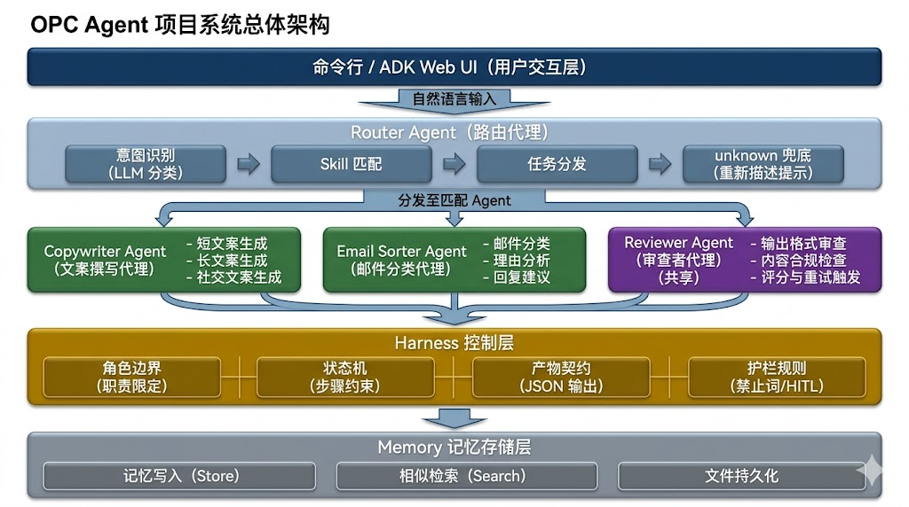
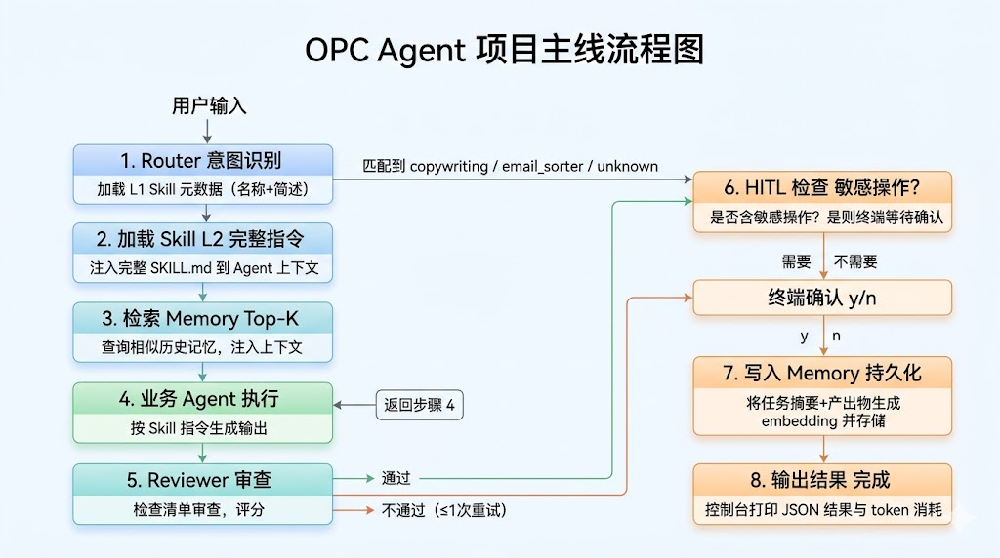
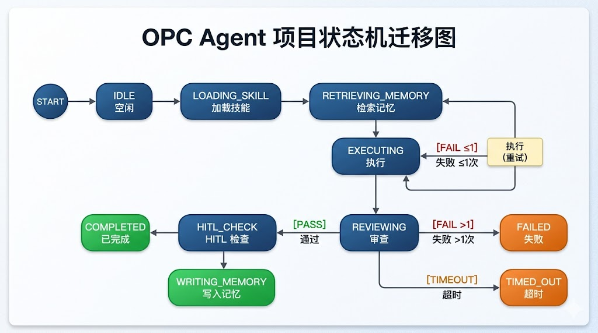

# OPC-Agent 概要设计说明书

> **版本**：v1.0  
> **日期**：2026-05-09  
> **关联文档**：[项目需求说明书 v1.1](./01%20多任务智能协助系统（OPC-Agent）——项目需求说明书.md)，[技术路线文档](./02%20OPC-Agent%20项目技术路线文档.md)  
> **项目代号**：OPC-Agent

---

## 1. 系统总体架构



> 架构说明：业务 Agent 不再编译进主程序，而是作为独立 Go Plugin (.so) 动态加载。主程序通过 `internal/runtime` 发现 `plugins/` 目录下的 .so 文件，通过 `plugin.Open()` + `Lookup("Agent")` 加载每个插件。新增 Agent 只需编写插件代码并独立编译，主程序无需重新编译。

---

## 2. 模块职责定义

| 模块 | 包路径 | 核心职责 |
|------|--------|----------|
| **Plugin Runtime** | `internal/runtime/` | 定义 AgentPlugin 接口，从 plugins/ 目录发现并动态加载 .so 插件，统一管理插件生命周期 |
| **Router Agent** | `internal/agent/router.go` | 接收用户自然语言输入，LLM 意图分类，匹配合适的插件 Agent，分发任务 |
| **Reviewer Agent** | `internal/agent/reviewer.go` | 共享审查 Agent，按对应 Skill 的检查清单审查输出，给予评分并触发放重试 |
| **Harness** | `internal/harness/` | 角色边界、状态机、产物契约、护栏规则的 Go 实现 |
| **HITL** | `internal/hitl/handler.go` | 终端交互式人工确认，阻塞等待用户 y/n 输入 |
| **Memory** | `internal/memory/` | 向量记忆引擎接口与嵌入式实现 |
| **Config** | `internal/config/config.go` | 从配置文件加载模型、插件目录、护栏规则等参数 |
| **业务 Agent 插件** | `plugins/*/plugin.go` | 独立编译的 .so 插件，实现 AgentPlugin 接口；每个插件有自己的 go.mod |

---

## 3. 执行流程设计

### 3.1 主线流程（用户发起任务 → 输出结果）



### 3.2 异常路径

| 场景 | 处理方式 |
|------|----------|
| Router 无法识别意图 | 返回 "unknown"，提示用户重新描述（最多 3 次重试） |
| Agent 执行超时（>30s） | context 超时取消，通知用户重试 |
| JSON 输出格式错误 | 正则提取 JSON 块 + 重试（最多 2 次） |
| Reviewer 审查不通过（重试后） | 输出审查不通过原因，由用户决定是否接受或手动修改 |
| HITL 用户拒绝 | 取消操作，不执行，记录到日志 |
| Memory 检索失败 | 静默降级——不注入记忆，不影响主线流程 |

---

## 4. Harness 四要素实现方案

### 4.1 角色边界（Role Boundary）

```go
type RoleBoundary struct {
    AgentID        string   // Agent 唯一标识
    Responsibilities []string // 职责列表
    AllowedTools   []string // 允许调用的工具
    ForbiddenWords []string // 禁止词列表
    MaxSteps       int      // 最大执行步骤数
}
```

- 每个 Agent 在初始化时声明 RoleBoundary
- Harness 在 Agent 执行前校验操作是否在边界内
- 越权操作触发 Guardrail 阻止并记录日志

### 4.2 状态机（State Machine）



- 状态变更通过 channel 广播到 Harness 监控
- 控制台实时打印状态流转信息

### 4.3 产物契约（Artifact Contract）

```go
type Artifact struct {
    SchemaName string      // 契约标识（如 "copywriting_output"）
    Version    string      // 版本号
    Data       interface{} // 结构化输出数据
    Raw        string      // LLM 原始输出
}
```

每个 Skill 定义结构化 JSON Schema 作为契约，Reviewer 按 Schema 验证。

### 4.4 护栏规则（Guardrail Rules）

```go
type GuardrailRule struct {
    Type        GuardrailType // BLOCK_WORD | MAX_STEPS | SENSITIVE_OP
    Pattern     string        // 匹配模式（禁止词正则、操作名）
    Action      GuardrailAction // BLOCK | HITL_CONFIRM | LOG_WARN
    Description string
}
```

---

## 5. 配置设计

配置文件 `config.yaml`（MVP 阶段）：

```yaml
app:
  name: "opc-agent"
  version: "0.1.0"

model:
  provider: "gemini"           # litellm provider
  name: "gemini-2.0-flash"    # model name
  temperature: 0.3
  max_tokens: 4096

runtime:
  plugins_dir: "./build/plugins"  # .so 插件目录

memory:
  engine: "embedded"           # embedded | pgvector
  top_k: 5                     # 检索相似记忆数
  similarity_threshold: 0.7    # 余弦相似度阈值
  store_path: "./data/memory.json"

harness:
  max_steps_per_agent: 10
  hitl_operations: ["send_email", "publish_post"]
  forbidden_words: ["guaranteed", "100% safe", "confidential_data"]
```

---

## 6. 可观测性设计

| 观测项 | 实现方式 | MVP 输出 |
|--------|----------|----------|
| **状态机流转** | 通过 channel 发射状态变更事件 | 控制台实时打印 "Router → executing → reviewing → completed" |
| **Token 消耗** | 每次 LLM 调用记录 input/output tokens | 任务结束时汇总打印 |
| **错误日志** | structured logging（log/slog） | 控制台 error 级别输出 |
| **Memory 操作** | 记录写入/检索事件 | 控制台 "Memory: retrieved 3 entries" |

---

## 7. 安全设计（MVP）

- **HITL 护栏**：所有标记为敏感的操作在执行前必须终端确认
- **禁止词过滤**：Agent 输出中命中禁止词时，Harness 阻止输出并触发 Reviewer
- **超时保护**：每个 Agent 执行绑定 context.WithTimeout(30s)
- **死循环检测**：状态机最大步骤计数，超限强制终止

---

*文档结束*
