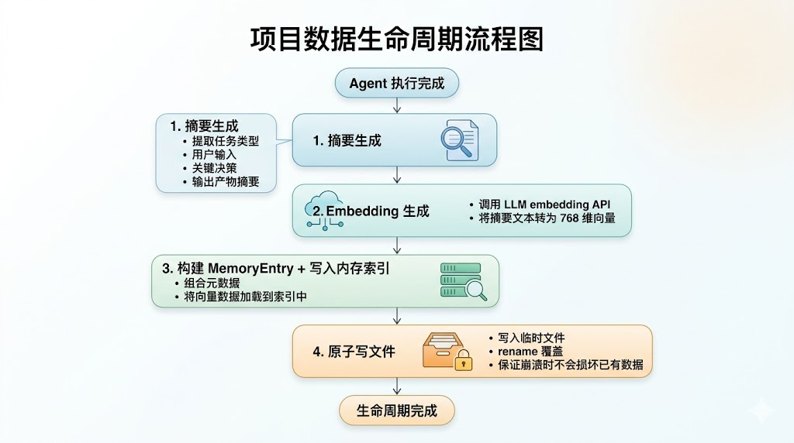

# OPC-Agent 数据存储设计说明书

> **版本**：v1.0  
> **日期**：2026-05-09  
> **关联文档**：[项目需求说明书 v1.1](./01%20多任务智能协助系统（OPC-Agent）——项目需求说明书.md)，[概要设计说明书](./03%20OPC-Agent%20概要设计说明书.md)  
> **项目代号**：OPC-Agent

---

## 1. 设计原则

| 原则 | 说明 |
|------|------|
| **零外部依赖** | MVP 阶段不依赖任何数据库服务，仅使用文件系统持久化 |
| **接口抽象** | 定义 `MemoryStore` 接口，后续可从嵌入式引擎无缝切换 pgvector |
| **崩溃安全** | 每次任务完成后写入文件，启动时自动恢复；写入采用原子写（先写临时文件再 rename） |
| **人类可读** | 存储格式使用 JSON，方便调试和手工查看 |
| **轻量级** | 单文件存储，MVP 数据量预期 < 10,000 条 |

---

## 2. 数据结构设计

### 2.1 记忆条目（Memory Entry）

```go
// MemoryEntry 表示一条记忆记录
type MemoryEntry struct {
    ID           string    `json:"id"`            // UUID
    CreatedAt    time.Time `json:"created_at"`     // 创建时间
    TaskType     string    `json:"task_type"`      // 任务类型 (copywriting/email_sorter)
    UserInput    string    `json:"user_input"`     // 用户原始输入
    AgentOutput  string    `json:"agent_output"`   // Agent 输出摘要
    KeyDecisions []string  `json:"key_decisions"`  // 关键决策列表
    Embedding    []float32 `json:"embedding"`      // 向量嵌入 (1536 维)
    Metadata     map[string]string `json:"metadata"` // 扩展元数据
}
```

### 2.2 存储文件格式

`data/memory.json` — 一个 JSON 数组文件：

```json
[
  {
    "id": "a1b2c3d4-...",
    "created_at": "2026-05-09T10:30:00+08:00",
    "task_type": "copywriting",
    "user_input": "帮我写一个智能水杯的新品文案",
    "agent_output": "生成三段文案：短文案(20字)...长文案(150字)...社交文案(80字)...",
    "key_decisions": ["风格选择：科技简约", "目标人群：25-35岁职场人群"],
    "embedding": [0.0123, -0.0456, 0.0789, ...],
    "metadata": {
      "model": "gemini-2.0-flash",
      "tokens_used": "1250",
      "review_score": "4.5"
    }
  }
]
```

### 2.3 向量维度

- 使用 LiteLLM 提供的 embedding API（gemini/text-embedding-004）
- 输出维度：**768 维**（Gemini embedding 模型）
- 存储格式：`[]float32`，JSON 序列化后约为 3KB/条

---

## 3. MemoryStore 接口设计

```go
// MemoryStore 定义记忆存储的核心操作
type MemoryStore interface {
    // Store 存储一条记忆条目
    Store(ctx context.Context, entry *MemoryEntry) error

    // Search 根据 query 检索最相似的 TopK 条记忆
    Search(ctx context.Context, query []float32, topK int) ([]*MemoryEntry, error)

    // Recall 便捷方法：输入文本 → 生成 embedding → Search
    Recall(ctx context.Context, text string, topK int) ([]*MemoryEntry, error)

    // Count 返回当前记忆总数
    Count(ctx context.Context) (int, error)

    // Close 关闭存储引擎，释放资源
    Close() error
}
```

### 嵌入式实现：EmbeddedEngine

```go
type EmbeddedEngine struct {
    mu       sync.RWMutex
    entries  []*MemoryEntry       // 内存中全量索引
    storePath string              // 持久化文件路径
}

func NewEmbeddedEngine(storePath string) (*EmbeddedEngine, error)
func (e *EmbeddedEngine) Store(ctx context.Context, entry *MemoryEntry) error
func (e *EmbeddedEngine) Search(ctx context.Context, query []float32, topK int) ([]*MemoryEntry, error)
func (e *EmbeddedEngine) Recall(ctx context.Context, text string, topK int) ([]*MemoryEntry, error)
func (e *EmbeddedEngine) Count(ctx context.Context) (int, error)
func (e *EmbeddedEngine) Close() error
```

---

## 4. 检索算法

### 余弦相似度

```go
// CosineSimilarity 计算两个向量的余弦相似度
func CosineSimilarity(a, b []float32) float32 {
    if len(a) != len(b) {
        return 0
    }
    var dotProduct, normA, normB float64
    for i := range a {
        dotProduct += float64(a[i]) * float64(b[i])
        normA += float64(a[i]) * float64(a[i])
        normB += float64(b[i]) * float64(b[i])
    }
    if normA == 0 || normB == 0 {
        return 0
    }
    return float32(dotProduct / (math.Sqrt(normA) * math.Sqrt(normB)))
}
```

### Top-K 搜索

```go
func (e *EmbeddedEngine) Search(ctx context.Context, query []float32, topK int) ([]*MemoryEntry, error) {
    e.mu.RLock()
    defer e.mu.RUnlock()

    type scored struct {
        entry *MemoryEntry
        score float32
    }

    results := make([]scored, 0, len(e.entries))
    for _, entry := range e.entries {
        score := CosineSimilarity(query, entry.Embedding)
        if score >= minSimilarityThreshold { // 默认 0.7
            results = append(results, scored{entry, score})
        }
    }

    // 按相似度降序排列
    sort.Slice(results, func(i, j int) bool {
        return results[i].score > results[j].score
    })

    // 取 TopK
    if len(results) > topK {
        results = results[:topK]
    }

    entries := make([]*MemoryEntry, len(results))
    for i, r := range results {
        entries[i] = r.entry
    }
    return entries, nil
}
```

---

## 5. 数据生命周期



### 启动恢复流程

```
启动 → 检查 data/memory.json 是否存在
  ├── 存在 → 反序列化到内存索引 → 就绪
  └── 不存在 → 创建空索引 → 就绪
```

### 文件紧凑化（可选优化）

- 当删除标记积累过多时，执行全量重写
- 删除仅在内存标记，重写时跳过已删除条目
- MVP 阶段不需要此机制（只增不删）

---

## 6. 后续迭代：pgvector 迁移

### 接口兼容

```go
// PGVectorStore 实现 MemoryStore 接口
type PGVectorStore struct {
    db *sql.DB
}

func NewPGVectorStore(connStr string) (*PGVectorStore, error)
func (p *PGVectorStore) Store(ctx context.Context, entry *MemoryEntry) error
func (p *PGVectorStore) Search(ctx context.Context, query []float32, topK int) ([]*MemoryEntry, error)
func (p *PGVectorStore) Recall(ctx context.Context, text string, topK int) ([]*MemoryEntry, error)
func (p *PGVectorStore) Count(ctx context.Context) (int, error)
func (p *PGVectorStore) Close() error
```

### 切换方式

```go
// config.yaml 中 memory.engine 控制
switch cfg.Memory.Engine {
case "embedded":
    store = memory.NewEmbeddedEngine(cfg.Memory.StorePath)
case "pgvector":
    store = memory.NewPGVectorStore(cfg.Memory.PGConnStr)
}
```

### pgvector DDL（后续迭代用）

```sql
CREATE EXTENSION IF NOT EXISTS vector;

CREATE TABLE memory_entries (
    id          UUID PRIMARY KEY DEFAULT gen_random_uuid(),
    created_at  TIMESTAMPTZ NOT NULL DEFAULT NOW(),
    task_type   TEXT NOT NULL,
    user_input  TEXT NOT NULL,
    agent_output TEXT NOT NULL,
    key_decisions TEXT[],
    embedding   VECTOR(768),
    metadata    JSONB
);

CREATE INDEX idx_memory_entries_embedding
    ON memory_entries
    USING ivfflat (embedding vector_cosine_ops)
    WITH (lists = 100);
```

---

## 7. 存储成本估算

| 指标 | MVP 嵌入式引擎 | 生产 pgvector |
|------|---------------|---------------|
| 单条记忆大小 | ~3KB（含 embedding） | ~3KB |
| 10,000 条记忆 | ~30MB 磁盘 / ~30MB 内存 | ~30MB 磁盘 |
| 100,000 条记忆 | ~300MB 内存（MVP 不需要） | ~300MB 磁盘 |
| 检索速度（10K 条） | <10ms（内存暴力搜索） | <5ms（IVFFlat 索引） |
| 崩溃恢复时间 | <1s（反序列化） | 数据库自带 |

---

*文档结束*
