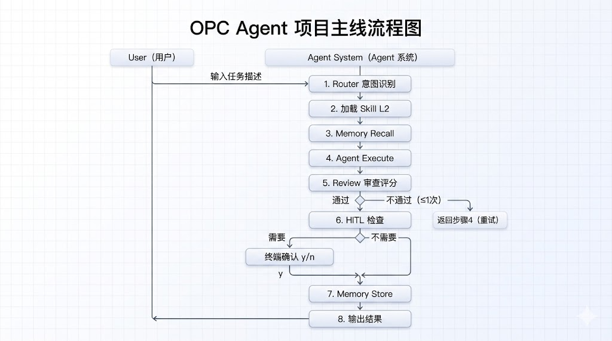

# OPC-Agent 详细设计说明书

> **版本**：v1.0  
> **日期**：2026-05-10  
> **关联文档**：[需求说明书 v1.1](./01%20多任务智能协助系统（OPC-Agent）——项目需求说明书.md)，[概要设计](./03%20OPC-Agent%20概要设计说明书.md)，[接口设计](./05%20OPC-Agent%20接口设计说明书.md)，[数据存储设计](./04%20OPC-Agent%20数据存储设计说明书.md)  
> **项目代号**：OPC-Agent

---

## 1. 引言

### 1.1 文档定位

本文档是 OPC-Agent 项目的详细设计说明书，面向实现阶段的 Go 开发者。以本文档为依据，开发者可直接进行各模块的编码实现。

### 1.2 设计目标

| 维度 | 目标 |
|------|------|
| **可实现性** | 每个模块的设计细节可直接指导编码，无模糊地带 |
| **一致性** | 与概要设计、接口设计中的约定完全一致 |
| **可测试性** | 每个模块明确边界与 Mock 策略，便于编写单元测试 |
| **错误完备性** | 覆盖正常路径、异常路径、边界条件 |
| **并发安全** | 明确共享资源的并发访问策略 |

### 1.3 模块全景

```
cmd/opc-agent/main.go          # 程序入口
├── internal/config/            # 配置加载与校验
├── internal/runtime/           # Plugin 运行时
│   ├── plugin.go              # AgentPlugin 接口定义
│   └── loader.go              # 插件发现与加载
├── internal/agent/             # 内置 Agent（Router + Reviewer）
│   ├── router.go              # Router Agent：意图识别与分发
│   └── reviewer.go            # Reviewer Agent：输出审查
├── internal/harness/           # Harness 控制系统
│   ├── role.go
│   ├── state.go
│   ├── contract.go
│   └── guardrail.go
├── internal/memory/            # 记忆存储
│   ├── store.go                # 接口定义
│   ├── entry.go                # 数据结构
│   └── engine.go               # 嵌入式实现
├── internal/hitl/              # 人工确认
│   └── handler.go
├── plugins/                    # Agent 插件源码（独立 module）
│   ├── copywriter/
│   │   ├── plugin.go          # 实现 AgentPlugin 接口
│   │   └── SKILL.md
│   └── email_sorter/
│       ├── plugin.go
│       └── SKILL.md
├── pkg/contracts/              # 输出契约（JSON Schema）
│   ├── copywriting.json
│   └── email_classification.json
└── build/                     # 构建产物
    ├── opc-agent
    └── plugins/
        ├── copywriter.so
        └── email_sorter.so
```

---

## 2. 总体设计原则

### 2.1 错误处理策略

```go
// 原则：所有可能失败的操作返回 error，不 panic（顶层 main 除外）
// 分层错误处理：
// - 内部模块：返回携带上下文的 error
// - 编排层：记录结构化日志后决定重试/降级/终止
// - 顶层 main：使用 log.Fatal 处理致命错误

// 错误包装规则：
if err != nil {
    return fmt.Errorf("module: operation: %w", err)
}
```

### 2.2 并发安全策略

| 资源 | 保护方式 | 说明 |
|------|----------|------|
| Memory 内存索引 | `sync.RWMutex` | 读多写少，Store 时写锁，Search 时读锁 |
| Config 全局配置 | 初始化后只读 | 启动时加载完成后不变 |
| Plugin Loader (plugins 映射) | 初始化后只读 | 启动时加载完成后不变 |
| 状态机流转 | goroutine 本地 | 每个 Agent 的执行路径在单 goroutine 内 |
| HITL 终端输入 | 无竞争 | 单用户顺序操作 |

### 2.3 上下文传递

```go
// 所有外部调用（LLM API、文件 I/O）均通过 context.Context 控制超时
ctx, cancel := context.WithTimeout(parentCtx, 30*time.Second)
defer cancel()
```

---

## 3. 模块详细设计

---

### 3.1 `internal/config` — 配置模块

#### 3.1.1 包职责

加载 YAML 配置文件，提供全局只读配置访问。

#### 3.1.2 核心类型

```go
// Config 全局配置（见接口设计文档 05 第 7 节）
// 补充：验证规则
func (c *Config) Validate() error {
    if c.Model.Provider == "" {
        return errors.New("model.provider is required")
    }
    if c.Memory.TopK <= 0 {
        c.Memory.TopK = 5 // 默认值
    }
    if c.Memory.SimilarityThreshold <= 0 {
        c.Memory.SimilarityThreshold = 0.7 // 默认值
    }
    if c.Harness.MaxStepsPerAgent <= 0 {
        c.Harness.MaxStepsPerAgent = 10 // 默认值
    }
    return nil
}
```

#### 3.1.3 加载流程

```
Load(path)
  │
  ├── 读取 YAML 文件 → 失败返回 error
  ├── yaml.Unmarshal → 失败返回 error
  ├── Validate() → 失败返回 error（含具体字段名）
  └── 返回 *Config（不可变）
```

#### 3.1.4 默认值策略

```go
// 不支持的场景：Hot Reload（MVP 阶段不实现配置热更新）
// 预期变更方式：修改文件后重启进程
```

#### 3.1.5 错误场景

| 场景 | 行为 |
|------|------|
| 文件不存在 | 使用内置默认配置（打印 warn 日志） |
| YAML 格式错误 | 返回 error，启动失败 |
| 必填字段缺失 | Validate() 返回具体错误 |
| 路径含空格 | 使用 os.Open 不受影响，要求用户提供正确路径 |

---

### 3.2 `internal/runtime` — Plugin 运行时

#### 3.2.1 包职责

提供 Agent 插件的统一接口定义与动态加载能力。主程序通过该模块发现 `plugins/` 目录下的 .so 文件，使用 Go 标准库的 `plugin.Open()` 加载并调用。

#### 3.2.2 AgentPlugin 接口

```go
// PluginInfo 插件元信息
type PluginInfo struct {
    Name         string   // Agent 名称，必须唯一
    Summary      string   // 简述（≤30 字）
    Version      string   // 插件版本
    Tags         []string // 标签
    RequiresHITL bool     // 是否需要 HITL 确认
}

type TokenUsage struct {
    InputTokens  int
    OutputTokens int
}

type ExecutionResult struct {
    Data       interface{} // 结构化输出（符合产物契约）
    TokenUsage TokenUsage
}

// AgentPlugin 所有 Agent 插件必须实现的接口
type AgentPlugin interface {
    Name() string
    Info() PluginInfo
    Execute(ctx context.Context, input string, opts map[string]interface{}) (*ExecutionResult, error)
    Review(ctx context.Context, output interface{}) (*ReviewResult, error)
}

// 插件入口符号（插件必须导出）
const PluginSymbol = "Agent"
```

#### 3.2.3 Loader 实现

```go
type Loader struct {
    pluginsDir string
    plugins    map[string]AgentPlugin
}

func NewLoader(pluginsDir string) *Loader

// LoadAll 扫描 pluginsDir 下所有 .so 文件，逐个加载
func (l *Loader) LoadAll() error {
    entries, err := os.ReadDir(l.pluginsDir)
    if err != nil {
        return fmt.Errorf("runtime: 读取目录 %s 失败：%w", l.pluginsDir, err)
    }
    for _, entry := range entries {
        if entry.IsDir() || filepath.Ext(entry.Name()) != ".so" {
            continue
        }
        if err := l.loadFile(filepath.Join(l.pluginsDir, entry.Name())); err != nil {
            // 单个插件加载失败不影响其他插件
            fmt.Printf("[Warning] 加载插件 %s 失败：%v\n", entry.Name(), err)
        }
    }
    return nil
}

func (l *Loader) loadFile(soPath string) error {
    p, err := plugin.Open(soPath)
    if err != nil {
        return fmt.Errorf("plugin.Open: %w", err)
    }
    sym, err := p.Lookup(PluginSymbol)
    if err != nil {
        return fmt.Errorf("Lookup(%s): %w", PluginSymbol, err)
    }
    agent, ok := sym.(AgentPlugin)
    if !ok {
        return fmt.Errorf("插件 %s 未实现 AgentPlugin 接口", soPath)
    }
    info := agent.Info()
    if _, exists := l.plugins[info.Name]; exists {
        return fmt.Errorf("Agent '%s' 已存在", info.Name)
    }
    l.plugins[info.Name] = agent
    fmt.Printf("[Plugin] 已加载：%s v%s\n", info.Name, info.Version)
    return nil
}

func (l *Loader) Get(name string) (AgentPlugin, bool)
func (l *Loader) List() []PluginInfo
func (l *Loader) Count() int
```

#### 3.2.4 Agent 插件编写示例

```go
// plugins/copywriter/plugin.go
package main

import "github.com/yourname/opc-agent/internal/runtime"

type CopywriterPlugin struct{}

func (p *CopywriterPlugin) Name() string { return "copywriter" }

func (p *CopywriterPlugin) Info() runtime.PluginInfo {
    return runtime.PluginInfo{
        Name: "copywriter",
        Summary: "根据产品信息生成三段式营销文案",
        Version: "1.0.0",
        Tags:    []string{"marketing", "copywriting"},
        RequiresHITL: true,
    }
}

func (p *CopywriterPlugin) Execute(ctx context.Context,
    input string, opts map[string]interface{}) (*runtime.ExecutionResult, error) {
    // 1. 从 opts 中提取记忆上下文
    memories, _ := opts["memories"].([]string)
    _ = memories

    // 2. 构建 ADK Agent + 执行逻辑
    prompt := buildCopywritingPrompt(input, memories)
    response := callLLM(ctx, cfg.Model.Name, prompt)

    // 3. 解析为结构化输出
    output, err := parseCopywritingOutput(response)
    if err != nil {
        return nil, err
    }

    return &runtime.ExecutionResult{
        Data: output,
        TokenUsage: runtime.TokenUsage{
            InputTokens:  response.InputTokens,
            OutputTokens: response.OutputTokens,
        },
    }, nil
}

func (p *CopywriterPlugin) Review(ctx context.Context,
    output interface{}) (*runtime.ReviewResult, error) {
    return nil, nil // 由主程序 Reviewer 处理
}

// 必须导出：插件入口符号
var Agent CopywriterPlugin
```

#### 3.2.5 xhs_poster 插件示例

```go
// plugins/xhs_poster/plugin.go
package main

import "github.com/yourname/opc-agent/internal/runtime"

type XHSPosterPlugin struct{}

func (p *XHSPosterPlugin) Name() string { return "xhs_poster" }

func (p *XHSPosterPlugin) Info() runtime.PluginInfo {
    return runtime.PluginInfo{
        Name:        "xhs_poster",
        Summary:     "生成小红书种草笔记内容",
        Version:     "1.0.0",
        Tags:        []string{"social-media", "xiaohongshu", "content-marketing"},
        RequiresHITL: true,
    }
}

func (p *XHSPosterPlugin) Execute(ctx context.Context,
    input string, opts map[string]interface{}) (*runtime.ExecutionResult, error) {

    memories, _ := opts["memories"].([]string)
    _ = memories

    // 构建小红书风格 prompt
    prompt := buildXHSPrompt(input, memories)
    response := callLLM(ctx, cfg.Model.Name, prompt)

    output, err := parseXHSOutput(response)
    if err != nil {
        return nil, err
    }

    return &runtime.ExecutionResult{
        Data: output,
        TokenUsage: runtime.TokenUsage{
            InputTokens:  response.InputTokens,
            OutputTokens: response.OutputTokens,
        },
    }, nil
}

func (p *XHSPosterPlugin) Review(ctx context.Context,
    output interface{}) (*runtime.ReviewResult, error) {
    return nil, nil
}

// 必须导出：插件入口符号
var Agent XHSPosterPlugin
```

#### 3.2.6 插件构建

```bash
# 每个插件独立编译，仅需几秒
cd plugins/copywriter
go build -buildmode=plugin -o ../../build/plugins/copywriter.so .
cd plugins/email_sorter
go build -buildmode=plugin -o ../../build/plugins/email_sorter.so .
cd plugins/xhs_poster
go build -buildmode=plugin -o ../../build/plugins/xhs_poster.so .

# 新增一个插件，只需这一步
cd plugins/new_agent
go build -buildmode=plugin -o ../../build/plugins/new_agent.so .
```

#### 3.2.6 插件约束

| 约束 | 说明 |
|------|------|
| **Go 版本** | 插件必须与主程序使用完全相同的 Go 版本编译 |
| **依赖版本** | 插件与主程序共享的依赖包必须版本一致 |
| **平台** | .so 文件仅限 Linux/macOS，不跨平台 |
| **热加载** | MVP 阶段不支持热加载，需重启生效 |
| **单例** | 每个 Agent 名称必须唯一，重复名称忽略 |

---

### 3.3 `internal/agent` — 内置 Agent

> 以下 Agent 内置在主程序中，不通过插件加载：**Router Agent**（需直接管理插件元数据）和 **Reviewer Agent**（通用审查逻辑）。

#### 3.3.1 Router Agent

##### 职责

接收用户自然语言输入，通过 LLM 判断意图，从已加载的插件列表中匹配合适的 Agent，分发任务。

##### 内部状态

```go
type Router struct {
    loader *runtime.Loader  // 插件加载器（提供 L1 元数据）
    model  string           // 模型名称
}

func NewRouter(loader *runtime.Loader, model string) *Router
```

##### 意图识别算法

```go
// classify 使用 LLM 判断用户意图对应的插件 Agent 名称
const classifyPromptTemplate = `
你是 OPC-Agent 的路由智能体。
请判断以下用户输入属于哪个 Agent 的技能范围。

可用 Agent：
{{range .Plugins}}
- {{.Name}}：{{.Summary}}
{{end}}

用户输入：{{.UserInput}}

请以 JSON 格式返回（仅返回 JSON）：
{
    "agent": "Agent 名称 或 unknown",
    "confidence": 0.0-1.0,
    "reason": "简短分类理由"
}
`

func (r *Router) classify(ctx context.Context, input string) (string, float32, error) {
    prompt := buildClassifyPrompt(r.loader.List(), input)
    response, err := callLLM(ctx, r.model, prompt)
    if err != nil {
        return "", 0, fmt.Errorf("router: %w", err)
    }
    result, err := parseJSONResponse(response)
    if err != nil {
        return "", 0, fmt.Errorf("router: parse failed: %w", err)
    }
    return result.Agent, result.Confidence, nil
}
```

##### 分发逻辑

```go
func (r *Router) Route(ctx context.Context, input string) (*RouteResult, error) {
    agentName, confidence, err := r.classify(ctx, input)
    if err != nil {
        return nil, err
    }

    if agentName == "unknown" || confidence < 0.4 {
        return &RouteResult{
            Action:  RouteActionUnknown,
            Message: "无法识别意图。提示：" + r.buildAvailableList(),
        }, nil
    }

    plugin, ok := r.loader.Get(agentName)
    if !ok {
        return &RouteResult{
            Action:  RouteActionUnknown,
            Message: fmt.Sprintf("Agent '%s' 未加载", agentName),
        }, nil
    }

    return &RouteResult{
        Action: RouteActionDispatch,
        Plugin: plugin,
        Info:   plugin.Info(),
    }, nil
}
```

##### 边界处理

| 场景 | 行为 |
|------|------|
| 插件目录为空（无 .so 文件） | 启动时打印警告，Router 返回 "无可用 Agent" |
| 用户输入为空 | 返回 "请输入任务描述" 提示 |
| 置信度 < 0.4 | 视为 unknown，要求重新描述 |
| LLM 调用超时 | 返回 error，触发顶层重试提示 |
| JSON 解析失败 | 最多重试 1 次，仍失败则返回 unknown |

#### 3.3.2 Reviewer Agent

（实现与之前一致，详见 [接口设计说明书](./05%20OPC-Agent%20接口设计说明书.md) 第 6 节。变化：Reviewer 的检查清单从插件对应的 SKILL.md 中提取，而非从 skill.Registry 获取。）

---

---

### 3.4 `internal/harness` — Harness 模块

#### 3.4.1 Role Boundary（角色边界）

```go
type RoleBoundary struct {
    AgentID        string
    Responsibilities []string
    AllowedTools   []string
    ForbiddenWords []string
    MaxSteps       int
}

// ValidateAction 校验 Agent 的操作是否在边界内
// 返回 nil 表示允许，返回 error 表示越权
func (rb *RoleBoundary) ValidateAction(action Action) error {
    // 1. 校验操作是否在 AllowedTools 中
    if !contains(rb.AllowedTools, action.Tool) {
        return &BoundaryViolationError{
            AgentID: rb.AgentID,
            Action:  action.Tool,
            Reason:  "使用的工具不在许可列表中",
        }
    }
    return nil
}

// ValidateOutput 校验 Agent 输出是否含禁止词
func (rb *RoleBoundary) ValidateOutput(output string) error {
    for _, word := range rb.ForbiddenWords {
        if strings.Contains(strings.ToLower(output), strings.ToLower(word)) {
            return &BoundaryViolationError{
                AgentID: rb.AgentID,
                Action:  "output_contains_forbidden_word",
                Reason:  fmt.Sprintf("输出含禁止词: %s", word),
            }
        }
    }
    return nil
}
```

#### 3.4.2 State Machine（状态机）

##### 状态定义

```go
// AgentState Agent 执行状态
type AgentState int

const (
    StateIdle           AgentState = iota // 空闲
    StateLoadingSkill                      // 加载 Skill L2
    StateRetrievingMemory                  // 检索记忆
    StateExecuting                         // 执行中
    StateReviewing                         // 审查中
    StateHITLCheck                         // 等待人工确认
    StateWritingMemory                     // 写入记忆
    StateCompleted                         // 完成
    StateFailed                            // 失败
    StateTimedOut                          // 超时
)

// 合法的状态转移矩阵
var validTransitions = map[AgentState][]AgentState{
    StateIdle:           {StateLoadingSkill},
    StateLoadingSkill:   {StateRetrievingMemory, StateFailed},
    StateRetrievingMemory: {StateExecuting, StateFailed},
    StateExecuting:      {StateReviewing, StateFailed, StateTimedOut},
    StateReviewing:      {StateExecuting, StateHITLCheck, StateFailed},
    StateHITLCheck:      {StateWritingMemory, StateFailed},
    StateWritingMemory:  {StateCompleted, StateFailed},
}
```

##### 状态机引擎

```go
type StateMachine struct {
    current      AgentState
    transitions  int     // 已执行步数
    maxTransitions int   // 最大步数限制
    listeners    []StateChangeListener
}

func NewStateMachine(maxTransitions int) *StateMachine

// Transition 尝试转移到目标状态
func (sm *StateMachine) Transition(target AgentState) error {
    allowed, ok := validTransitions[sm.current]
    if !ok {
        return fmt.Errorf("状态 %d 无合法转移", sm.current)
    }

    if !containsState(allowed, target) {
        return fmt.Errorf("非法转移：%d → %d", sm.current, target)
    }

    sm.transitions++
    if sm.transitions > sm.maxTransitions {
        sm.current = StateFailed
        return fmt.Errorf("超过最大执行步数 (%d)", sm.maxTransitions)
    }

    prev := sm.current
    sm.current = target
    sm.notifyListeners(prev, target)
    return nil
}

// Subscribe 注册状态变更监听器（用于可观测性日志）
func (sm *StateMachine) Subscribe(listener StateChangeListener) {
    sm.listeners = append(sm.listeners, listener)
}
```

##### 可观测性日志

```go
// 默认监听器：控制台打印
func defaultStateLogger(prev, curr AgentState) {
    fmt.Printf("[State] %s → %s\n", stateName(prev), stateName(curr))
}
```

#### 3.4.3 Artifact Contract（产物契约）

```go
// Artifact 表示一次 Agent 执行的产出物
type Artifact struct {
    SchemaName string      // 契约标识
    Version    string      // 契约版本
    Data       interface{} // 结构化的产出数据
    Raw        string      // LLM 原始输出
    TokenUsage TokenUsage  // token 消耗
}

// ValidateArtifact 校验产出物是否符合 Schema 定义
// 使用 JSON Schema 校验（MVP 使用 Go 结构体验证替代）
func ValidateArtifact(artifact *Artifact, expectedSchema string) error {
    // MVP 阶段：通过 Go 结构体的 Validate() 方法完成
    // 后续迭代：接入正式 JSON Schema 校验库
    if artifact.SchemaName != expectedSchema {
        return fmt.Errorf("契约类型不匹配：期望 %s，实际 %s",
            expectedSchema, artifact.SchemaName)
    }
    return nil
}
```

#### 3.4.4 Guardrail（护栏规则）

```go
type GuardrailType int

const (
    GuardrailBlockWord   GuardrailType = iota // 禁止词阻止
    GuardrailMaxSteps                          // 最大步数
    GuardrailSensitiveOp                       // 敏感操作
)

type GuardrailAction int

const (
    ActionBlock      GuardrailAction = iota // 直接阻止
    ActionHITLConfirm                       // 人工确认
    ActionLogWarn                           // 记录警告
)

type GuardrailRule struct {
    Type    GuardrailType
    Pattern string           // 匹配模式（禁止词/操作名）
    Action  GuardrailAction
}

// GuardrailEngine 护栏规则引擎
type GuardrailEngine struct {
    rules []GuardrailRule
}

func (ge *GuardrailEngine) Check(ctx context.Context, checkItem interface{}) (*GuardrailResult, error) {
    // 遍历规则，判断是否命中
    // 命中的最高优先级规则决定 Action
    // 多个规则命中时，取 Action 最严格的那个
    // 优先级：Block > HITLConfirm > LogWarn
}
```

---

### 3.5 `internal/memory` — 记忆模块

#### 3.5.1 MemoryStore 接口

（定义见 [数据存储设计说明书](./04%20OPC-Agent%20数据存储设计说明书.md) 第 3 节）

#### 3.5.2 EmbeddedEngine 详细实现

```go
type EmbeddedEngine struct {
    mu       sync.RWMutex
    entries  []*MemoryEntry
    storePath string
}

func NewEmbeddedEngine(storePath string) (*EmbeddedEngine, error) {
    engine := &EmbeddedEngine{
        entries:   make([]*MemoryEntry, 0),
        storePath: storePath,
    }
    if err := engine.loadFromDisk(); err != nil {
        // 文件不存在或损坏时，从空状态开始
        fmt.Printf("[Memory] 无法加载历史记忆：%v，将从空白状态开始\n", err)
    }
    return engine, nil
}
```

##### 写入流程（原子写）

```go
func (e *EmbeddedEngine) Store(ctx context.Context, entry *MemoryEntry) error {
    e.mu.Lock()
    defer e.mu.Unlock()

    // 1. 追加到内存索引
    e.entries = append(e.entries, entry)

    // 2. 持久化到磁盘（原子写）
    return e.atomicPersist()
}

// atomicPersist 原子写：临时文件 → rename 覆盖
// 防止写入过程中进程崩溃导致文件损坏
func (e *EmbeddedEngine) atomicPersist() error {
    tmpPath := e.storePath + ".tmp"

    // 序列化
    data, err := json.MarshalIndent(e.entries, "", "  ")
    if err != nil {
        return fmt.Errorf("memory: serialize failed: %w", err)
    }

    // 写入临时文件
    if err := os.WriteFile(tmpPath, data, 0644); err != nil {
        return fmt.Errorf("memory: write tmp file failed: %w", err)
    }

    // rename 覆盖原文件（POSIX 原子操作）
    if err := os.Rename(tmpPath, e.storePath); err != nil {
        return fmt.Errorf("memory: rename failed: %w", err)
    }

    return nil
}
```

##### 检索流程

```go
func (e *EmbeddedEngine) Search(ctx context.Context, query []float32, topK int) ([]*MemoryEntry, error) {
    // 见数据存储设计第 4 节
    // 补充：
    // - 当 entries 为空时返回 nil, nil（非错误）
    // - 当 query 长度与 embedding 不匹配时返回 error
    // - topK <= 0 时使用配置的默认值
}
```

##### 启动恢复

```go
func (e *EmbeddedEngine) loadFromDisk() error {
    data, err := os.ReadFile(e.storePath)
    if err != nil {
        return err // 文件不存在时由调用方处理
    }

    if err := json.Unmarshal(data, &e.entries); err != nil {
        // 文件损坏：尝试从备份恢复
        backupPath := e.storePath + ".bak"
        if backupData, err2 := os.ReadFile(backupPath); err2 == nil {
            if err2 := json.Unmarshal(backupData, &e.entries); err2 == nil {
                fmt.Println("[Memory] 从备份文件恢复成功")
                return nil
            }
        }
        return fmt.Errorf("memory: unmarshal failed: %w", err)
    }

    fmt.Printf("[Memory] 加载了 %d 条历史记忆\n", len(e.entries))
    return nil
}
```

##### 降级策略

```go
// 记忆检索失败不影响主线流程：
// - Store 失败 → 打印错误日志，继续执行（数据丢失但不影响当前输出）
// - Search 失败 → 返回空结果，Agent 没有记忆上下文
// - 文件损坏 → 从 .bak 恢复，无可恢复时从空状态开始
```

---

### 3.6 `internal/hitl` — HITL 模块

#### 3.6.1 包职责

在敏感操作前以终端交互方式等待用户确认。

#### 3.6.2 实现

```go
type Handler struct {
    reader  io.Reader
    writer  io.Writer
    timeout time.Duration // 等待用户输入的超时时间，0 表示不超时
}

func NewHandler(reader io.Reader, writer io.Writer) *Handler {
    return &Handler{
        reader:  reader,
        writer:  writer,
        timeout: 0, // MVP 不设超时，用户不确认就无限等待
    }
}

func (h *Handler) Confirm(ctx context.Context, op Operation) (bool, error) {
    fmt.Fprintf(h.writer, "\n"+
        "═══════════════════════════════════════════════\n"+
        "  ⚠️  需要您的确认\n"+
        "  操作：%s\n"+
        "  详情：%s\n"+
        "═══════════════════════════════════════════════\n"+
        "  请输入 y（同意）/ n（拒绝）：", op.Type, op.Description)

    // 使用 bufio.Scanner 读取用户输入
    scanner := bufio.NewScanner(h.reader)
    if !scanner.Scan() {
        return false, fmt.Errorf("HITL: 读取输入失败")
    }

    input := strings.TrimSpace(strings.ToLower(scanner.Text()))
    return input == "y" || input == "yes", nil
}
```

#### 3.6.3 集成方式

```go
// 使用 os.Stdin / os.Stdout 初始化：
hitlHandler := hitl.NewHandler(os.Stdin, os.Stdout)

// 测试时可注入 bytes.Buffer：
var inputBuf bytes.Buffer
inputBuf.WriteString("y\n")
hitlHandler := hitl.NewHandler(&inputBuf, os.Stdout)
```

---

### 3.7 `cmd/opc-agent` — 程序入口

#### 3.7.1 main.go 结构

```go
func main() {
    // 1. 解析命令行参数（--config, --plugins-dir）
    configPath := flag.String("config", "config.yaml", "配置文件路径")
    flag.Parse()

    // 2. 加载配置
    cfg, err := config.Load(*configPath)
    if err != nil {
        log.Fatalf("加载配置失败：%v", err)
    }

    // 3. 初始化插件加载器，加载所有 Agent 插件
    pluginLoader := runtime.NewLoader(cfg.Runtime.PluginsDir)
    if err := pluginLoader.LoadAll(); err != nil {
        log.Fatalf("加载插件失败：%v", err)
    }
    fmt.Printf("[系统] 已加载 %d 个 Agent 插件\n", pluginLoader.Count())

    // 4. 初始化记忆引擎
    memoryStore, err := memory.NewEmbeddedEngine(cfg.Memory.StorePath)
    if err != nil {
        log.Printf("警告：初始化记忆引擎失败：%v", err)
        memoryStore = memory.NewEmptyEngine() // 降级
    }
    defer memoryStore.Close()

    // 5. 初始化 HITL
    hitlHandler := hitl.NewHandler(os.Stdin, os.Stdout)

    // 6. 初始化 Router（基于已加载的插件元数据）
    router := agent.NewRouter(pluginLoader, cfg.Model.Name)

    // 7. 初始化 Reviewer
    reviewer := agent.NewReviewer(cfg.Model.Name)

    // 8. 启动主循环（REPL）
    fmt.Println("OPC-Agent 已就绪")
    scanner := bufio.NewScanner(os.Stdin)
    for {
        fmt.Print("\n> ")
        if !scanner.Scan() {
            break
        }
        input := scanner.Text()
        if input == "exit" || input == "quit" {
            break
        }

        processTask(context.Background(), input, pluginLoader, router,
            reviewer, memoryStore, hitlHandler, cfg)
    }
}
```

#### 3.7.2 任务处理主函数

```go
func processTask(ctx context.Context, input string,
    loader *runtime.Loader, router *agent.Router,
    reviewer *agent.Reviewer, store memory.MemoryStore,
    hitl *hitl.Handler, cfg *config.Config) {

    fmt.Println("\n[Task] 开始处理...")

    // 1. Router 分发（匹配插件）
    routeResult := router.Route(ctx, input)
    if routeResult.Action == agent.RouteActionUnknown {
        fmt.Println(routeResult.Message)
        return
    }

    // 2. 检���记忆
    memories, _ := store.Recall(ctx, input, cfg.Memory.TopK)

    // 3. 调用插件 Execute
    opts := map[string]interface{}{
        "memories": memories,
    }
    execResult, err := routeResult.Plugin.Execute(ctx, input, opts)
    if err != nil {
        fmt.Printf("[Error] Agent 执行失败：%v\n", err)
        return
    }

    // 4. Reviewer 审查
    reviewResult, _ := reviewer.Review(ctx, execResult.Data,
        routeResult.Info.Tags, execResult.Data)
    if reviewResult != nil && !reviewResult.Passed {
        if reviewResult.ShouldRetry {
            // 重试一次
            execResult, err = routeResult.Plugin.Execute(ctx, input, opts)
            if err == nil {
                reviewResult, _ = reviewer.Review(ctx, execResult.Data,
                    routeResult.Info.Tags, execResult.Data)
            }
        }
        if reviewResult != nil && !reviewResult.Passed {
            fmt.Printf("审查未通过：%s\n", reviewResult.Summary)
            fmt.Println("输出：")
        }
    }

    // 5. HITL 检查
    if routeResult.Info.RequiresHITL {
        op := hitl.Operation{
            Type:        routeResult.Info.Name,
            Description: fmt.Sprintf("Agent '%s' 请求执行", routeResult.Info.Name),
        }
        approved, _ := hitl.Confirm(ctx, op)
        if !approved {
            fmt.Println("操作已取消")
            return
        }
    }

    // 6. 写入记忆
    entry := buildMemoryEntry(input, execResult.Data)
    if err := store.Store(ctx, entry); err != nil {
        fmt.Printf("[Warning] 记忆写入失败：%v\n", err)
    }

    // 7. 输出结果
    printOutput(execResult.Data)
    fmt.Printf("\n[Token] 输入：%d，输出：%d\n",
        execResult.TokenUsage.InputTokens, execResult.TokenUsage.OutputTokens)
}
```

---

## 4. 核心流程详细设计

### 4.1 完整执行时序



### 4.2 超时处理

```go
// 整个任务链的超时控制
func processTaskWithTimeout(parentCtx context.Context, input string) {
    ctx, cancel := context.WithTimeout(parentCtx, 30*time.Second)
    defer cancel()

    done := make(chan struct{})
    var result interface{}

    go func() {
        result = processTask(ctx, input)
        close(done)
    }()

    select {
    case <-done:
        printResult(result)
    case <-ctx.Done():
        fmt.Println("⏰ 任务处理超时（30秒），请简化描述后重试")
    }
}
```

### 4.3 重试与降级矩阵

| 失败场景 | 重试策略 | 降级行为 |
|----------|----------|----------|
| Router 意图识别失败 | 重试 1 次 | 返回 "unknown" 引导用户 |
| Agent LLM 调用超时 | 重试 1 次（超时时间相同） | 通知用户当前不可用 |
| JSON 输出解析失败 | 正则提取 + 重试 1 次 | 返回原始文本输出 |
| Reviewer 审查不通过 | 重试 1 次 | 展示结果+审查报告，用户决定 |
| Memory Store 写入失败 | 不重试（写一次） | 打印警告，继续执行 |
| Memory Search 失败 | 不重试 | 无记忆上下文，Agent 降级运行 |
| HITL 用户拒绝 | — | 取消操作，记录日志 |
| 配置加载失败 | — | 进程退出（无法启动） |

---

## 5. 启动与关闭流程

### 5.1 启动顺序

```
1. 解析命令行参数（--config, --plugins-dir）
2. 加载并校验配置 ──── 失败 → log.Fatal
3. 初始化 Runtime Loader
   └── 扫描 cfg.Runtime.PluginsDir 目录
       ├── 找到 copywriter.so → plugin.Open → agent.CopywriterPlugin
       ├── 找到 email_sorter.so → plugin.Open → agent.EmailSorterPlugin
       └── 其余 .so 文件同样处理
       └── 单个插件失败不影响其他插件（打印警告）
4. 初始化 Memory Engine
   └── 尝试加载 data/memory.json ── 不存在则创建空索引
5. 初始化 HITL Handler
6. 初始化 Router（接收 Loader 的 List() 作为 L1 元数据）
7. 初始化 Reviewer
8. 打印 Banner + 已加载 Agent 列表
9. 进入 REPL 主循环
```

### 5.2 关闭顺序

```
1. 收到 exit/quit 或 SIGINT（Ctrl+C）
2. Memory Engine Close（持久化未写入的记忆）
3. 打印统计摘要（任务数、token 总数、调用次数）
4. 退出进程
```

---

## 6. 测试策略

### 6.1 单元测试覆盖

| 模块 | 测试重点 | Mock 策略 |
|------|----------|-----------|
| config | 加载、校验、默认值 | 临时 YAML 文件 |
| runtime/loader | 插件发现、plugin.Open、Lookup、重复名称处理 | 测试用 .so 文件 / 接口 Mock |
| runtime/plugin | AgentPlugin 接口契约验证 | 实现 mockAgentPlugin |
| agent/router | 分类、分发、unknown 兜底 | Mock LLM 调用 |
| agent/reviewer | 审查逻辑、重试计数 | Mock LLM 调用 |
| harness/state | 状态转移合法性、死循环检测 | 纯逻辑，无外部依赖 |
| harness/guardrail | 规则命中、优先级 | 纯逻辑，无外部依赖 |
| memory/engine | Store、Search、持久化、恢复 | 临时文件 |
| hitl | Confirm 输入解析 | bytes.Buffer 注入 |

### 6.2 集成测试

```go
// 端到端测试（不使用真实 LLM，使用 mock）
func TestEndToEnd(t *testing.T) {
    // 1. 设置 mock LLM
    // 2. 编译测试用 .so 插件并加载
    // 3. 初始化内存引擎（临时目录）
    // 4. 输入任务 → 验证全链路执行（Router → 插件 Execute → Reviewer）
    // 5. 验证记忆已写入
    // 6. 验证 token 统计
}
```

### 6.3 NF 测试（非功能需求验证）

| 测试项 | 方法 | 通过标准 |
|--------|------|----------|
| 响应时间 < 30s | mock LLM 返回固定延迟 500ms | 单次任务 < 3s（不含 LLM 调用） |
| 20 次成功率 ≥ 90% | 连续执行 20 次 mock 任务 | ≤ 2 次失败 |
| 路由准确率 ≥ 90% | 30 次不同输入 | ≤ 3 次错误路由 |
| 内存占用 ≤ 500MB | 执行 100 次任务后检查 | RSS < 500MB |

---

## 7. 模块依赖关系图

```
cmd/opc-agent/main.go
    │
    ├── internal/config           (独立)
    ├── internal/runtime          (独立：文件 I/O — 扫描 plugins/ 目录)
    │   └── 加载 plugins/*.so     (Go plugin 标准库)
    ├── internal/memory           (独立：文件 I/O)
    ├── internal/hitl             (独立：终端 I/O)
    ├── internal/harness          (依赖：config)
    ├── internal/agent            (依赖：runtime, memory, config)
    │   ├── router.go             (通过 runtime.Loader 获取插件元数据)
    │   └── reviewer.go
    └── pkg/contracts             (独立：JSON Schema)

plugins/                         (独立 module，与主程序通过 AgentPlugin 接口耦合)
    ├── copywriter/plugin.go     (import "internal/runtime" for AgentPlugin)
    ├── email_sorter/plugin.go
    └── future_agent/plugin.go
```

**模块间耦合策略：**
- 主程序模块通过接口依赖，而非具体类型
- `internal/agent` 通过 `runtime.Loader` 获取 `AgentPlugin` 接口
- 插件的耦合：仅依赖 `internal/runtime` 包（接口定义）
- 其余模块不直接依赖插件内部实现
- main.go 负责所有模块的组装（依赖注入）

---

*文档结束*
